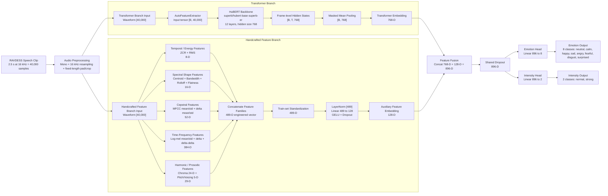
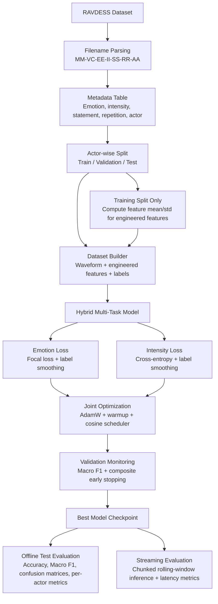

# Speech Emotion Recognition Architecture Diagram

This file contains research-project-ready Mermaid diagrams for the model and the training pipeline we used.

## 1. Hybrid Model Architecture

## 2. Training and Evaluation Pipeline

## 3. Caption You Can Reuse

Figure: Proposed hybrid speech emotion recognition architecture. A fixed-length speech waveform is processed in parallel by a pretrained HuBERT transformer branch and a handcrafted acoustic-feature branch. The handcrafted branch extracts temporal, spectral, cepstral, time-frequency, and pitch/voicing descriptors, which are normalized and projected through an auxiliary MLP. The transformer embedding and engineered-feature embedding are fused and passed to two task-specific heads for emotion classification and intensity classification.

## 4. Short Explanation for the Research Document

Why we used this architecture:
- The transformer branch learns rich contextual speech representations directly from raw audio.
- The engineered-feature branch preserves interpretable acoustic cues such as energy, timbre, spectral shape, and pitch dynamics.
- Feature fusion helps the model combine deep learned patterns with classic speech descriptors.
- Multi-task learning allows the same model to predict both emotion category and emotion intensity.

## 5. Notes

Feature families used in the engineered branch:
- ZCR, RMS
- Spectral centroid, bandwidth, rolloff, flatness
- MFCC mean/std
- Delta MFCC mean/std
- Log-mel mean/std
- Delta log-mel mean/std
- Delta-delta log-mel mean/std
- Chroma mean/std
- Pitch statistics
- Voiced ratio

Backbone used:
- `superb/hubert-base-superb-er`
- 12 transformer layers
- hidden size: 768
- auxiliary MLP: 489 to 128
- fused representation: 896

Outputs used:
- Emotion classification: 8 classes
- Intensity classification: 2 classes
